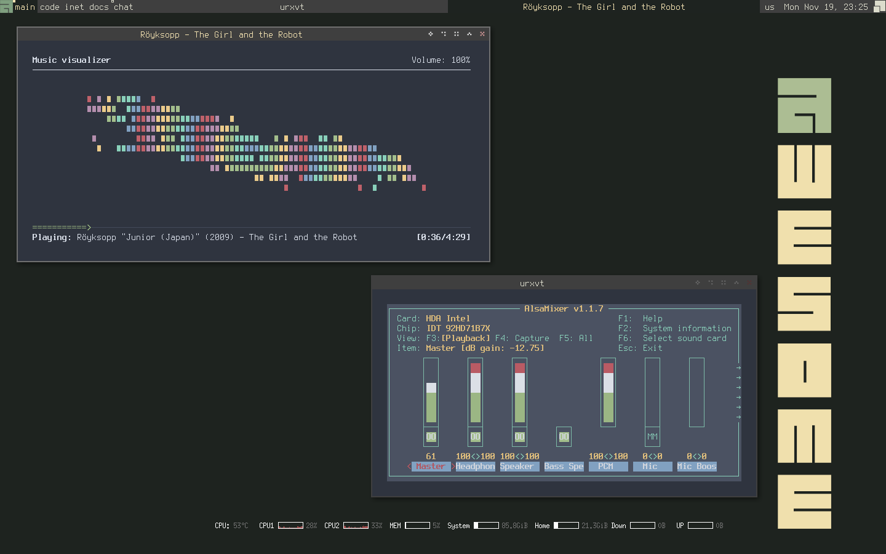

# .dotfiles
A bunch of dotfiles for console style based desktop. The main purpose is to create a minimalist and comfortable environment with a focus on the use of console applications.

## Prerequisites
### Next software should be installed for only desktop session configuration:
* `Xorg`
* `xorg-xinit` - runs user's desktop session without display manager
* `awesome`
* `compton`
* `conky` - system info monitor
* `terminus-font` - maybe it is not enough to install, because different distributions have different names for this font. Anyway, fix font name in the config files, if it does not work.

### Next software is configured with this dotfiles and recommended to be installed:
* `xorg-setxkbmap` - I use it to set up keyboard layout switching with Caps Lock key. You can find its usage in .config/awesome/rc.lua
* `rxvt-unicode` - I have configured clipboard and appearance for it. You can find nord color scheme I have used here in config files
* `unclutter` - makes cursor invisible, if it is idle for a long time
* `vim`
* `zsh` - I have configured zsh with history, highlight and suggestion plugins. It looks pretty good.
* `ranger`, `w3m` - console-like file manager, w3m is used for image preview
* `mpd`, `mpc`, `ncmpcpp` - music daemon and his console frontends: first one for mpd configuration, second one is for interraction.
* `neofetch` - system info fetcher
* `rtorrent` - console-like torrent client
* `qutebrowser`, `ttf-droid` - minimalist, based on Qt5WebEngine, convinient for only keyboard users browser.
* `feh` - minimalist image viewer
* `mpv` - minimalist video player
* `htop` - cool process monitor
* `scrot` - minimalist screenshot tool
* `xcursor-neutral`
* `lxappearance` - tool used for gtk configuration (if your system has no tool for gtk config; you can use this to config xcursor-neutral cursors)
* `yay-git` - AUR-helper

## Installation

For Arch Linux users I have provided commands to install all packages needed for this configs.
Update pacman database:
```bash
sudo pacman --sync --refresh
```
Install base packages:
```bash
sudo pacman --sync xorg-server xorg-xinit awesome compton unclutter conky terminus-font
```
Install other packages:
```bash
sudo pacman --sync feh qutebrowser htop lxappearance mpd mpc ncmpcpp neofetch rtorrent scrot ttf-droid xcursor-neutral ranger rxvt-unicode vim zsh xorg-setxkbmap mpv
```
yay-git should be installed from AUR

## Screenshots


## Config info
TODO
## Roadmap
TODO
