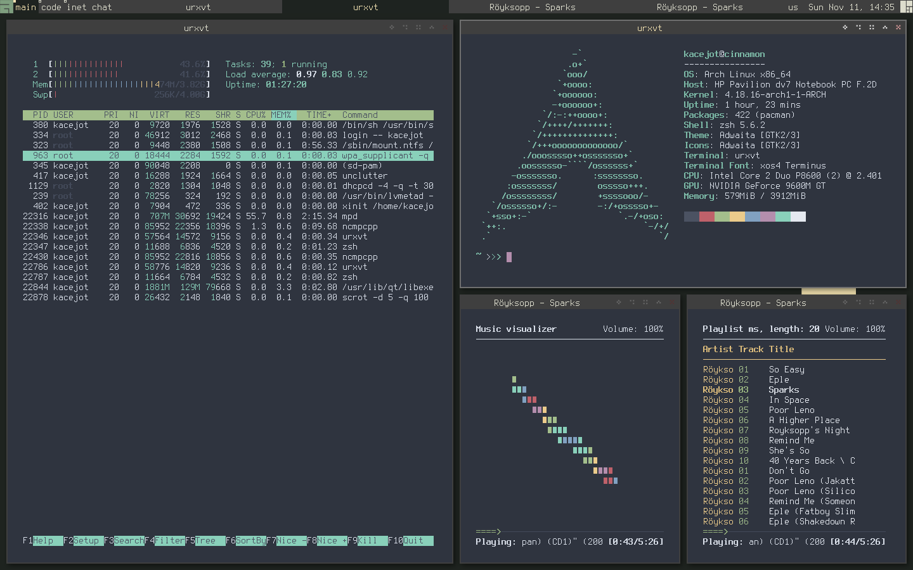

# .dotfiles
A bunch of dotfiles for console style based desktop. The main purpose is to create a minimalist and comfortable environment with a focus on the use of console applications.

## Getting started
Here you can see all my environment as Arch Linux packages. In addition there is an instruction about how to install config files

### Prerequisites
All the things you need are described here. This ones are packages from supported arch linux repository. You can try find analogs of this packages for your distribution.

Necessary ones:
```bash
xorg-server
xorg-xinit
xorg-setxkbmap
awesome
compton
unclutter
conky
xcursor-neutral
rxvt-unicode
ranger
terminus-font
vim
zsh
```

Other:
```bash
feh
qutebrowser
htop
lxappearance
mpd
mpc
ncmpcpp
neofetch
rtorrent
scrot
ttf-droid
yay-git
```

### Installation

Install all necessary packages that are listed above. For Arch Linux users I have provided commands below:
```bash
sudo pacman --sync --refresh
sudo pacman --sync xorg-server xorg-xinit xorg-setxkbmap awesome compton unclutter conky xcursor-neutral rxvt-unicode ranger terminus-font vim zsh 
```
And for non-required packages:
```bash
sudo pacman --sync feh qutebrowser htop lxappearance mpd mpc ncmpcpp neofetch rtorrent scrot ttf-droid
```
yay-git should be installed from AUR

## Screenshots


